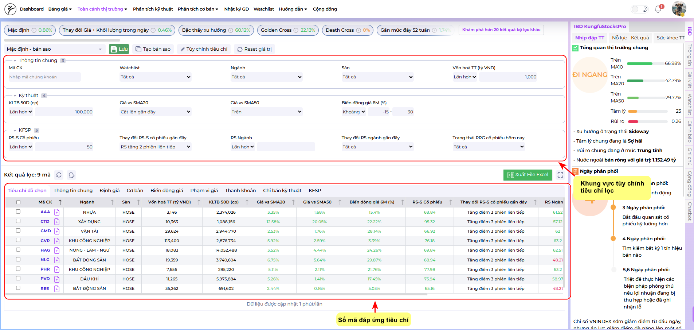

# 🎯 Hướng Dẫn Sử Dụng Bộ Lọc KFSP
### Săn Tìm Cổ Phiếu Tích Lũy và Bùng Nổ

---

## 👋 Chào mừng nhà đầu tư!

**Bộ lọc KFSP** không chỉ là công cụ tìm cổ phiếu, mà là cách tiếp cận giúp nhà đầu tư **nhận diện sớm những cổ phiếu đang mạnh dần lên trong thị trường** — trước khi chúng thực sự trở thành “ngôi sao dẫn dắt” của chu kỳ tăng mới.

Mục tiêu của bộ lọc này là tìm ra nhóm cổ phiếu đang hình thành sức mạnh, nhưng chưa có nhịp tăng mạnh trước đó, thể hiện dấu hiệu tích lũy chặt chẽ, thanh khoản cải thiện, và dòng tiền bắt đầu quay lại.

Hướng dẫn này sẽ giúp bạn tìm kiếm các cổ phiếu có:  

- **Sức mạnh giá tương đối (RS)** mạnh lên gần đây.  
- **Giá cắt lên các đường trung bình động (MA)** quan trọng - dấu hiệu dòng tiền đang quay lại..  
- **Mức tăng giá chưa quá “nóng”** so với vùng đáy 6 tháng, cho thấy cổ phiếu vẫn còn dư địa để tăng trưởng.

👉 Đây là “công thức nhận diện sớm” những cổ phiếu đang chuyển mình từ tích lũy sang xu hướng tăng — ứng viên tiềm năng cho vị trí dẫn dắt thị trường tiếp theo.

---

## Bước 1: Truy Cập Bộ Lọc  

| **Phương thức** | **Thao tác** |
|------------------|--------------|
| **Trên Website** | Truy cập trực tiếp vào đường dẫn: [https://kfsp.vn/bo-loc](https://kfsp.vn/bo-loc) |
| **Trên Ứng Dụng (App)** | Mở ứng dụng **KFSP** → Nhấn vào biểu tượng **bộ lọc màu tím** ở trung tâm thanh điều hướng phía dưới màn hình → Chọn mục **“Bộ lọc”**. |

---

## Bước 2: Thêm và Thiết Lập Tiêu Chí Lọc  

Sau khi truy cập, bấm vào nút **“Tùy chỉnh tiêu chí”**. Một bảng chọn tiêu chí sẽ hiện ra.

### 🔹 2.1. Thêm Tiêu Chí Kỹ Thuật

1. Chọn tab **Kỹ thuật** (Tab thứ hai).  
2. Ở khu vực **“Biến động giá”** → tích chọn **Biến động giá 6M** *(giúp kiểm soát mức tăng trưởng trong 6 tháng)*.  
3. Ở khu vực **“Khối lượng giao dịch”** → tích chọn **KLTB 50D** *(Khối lượng Giao dịch Trung bình 50 ngày)* để đảm bảo tính thanh khoản.  
4. Kéo xuống khu vực **“Đường trung bình động (SMA)”** → tích chọn **Giá vs SMA20** và **Giá vs SMA50** *(xác định xu hướng ngắn và trung hạn)*.  

---

### 🔹 2.2. Thêm Tiêu Chí Sức Mạnh Giá (RS)  

1. Chuyển sang tab **KFSP** (Tab thứ năm).  
2. Tích chọn 4 tiêu chí sau:  
   - **RS-S Cổ phiếu**  
   - **Thay đổi RS-S cổ phiếu gần đây**  
   - **RS Ngành**  
   - **Thay đổi RS ngành gần đây**  
3. Bấm "Lưu"  

💡 **Giải thích nhanh:**  
- **RS (Relative Strength)** là chỉ báo *Sức mạnh Giá Tương đối*.  
- **RS-S Cổ phiếu ≥ 50** cho thấy cổ phiếu mạnh hơn ≥ 50% số cổ phiếu khác trên thị trường.  
- RS tăng gần đây → *sức mạnh đang cải thiện rõ rệt*.

---

## Bước 3: Điều Chỉnh Thông Số Lọc  

Bây giờ, bạn sẽ điều chỉnh thông số của các tiêu chí ở bảng phía trên cùng.  

| **Tiêu chí lọc** | **Điều kiện** | **Ý nghĩa (Tại sao chọn?)** |
|------------------|----------------|-----------------------------|
| **Vốn hóa TT** | > 1,000 (tỷ VND) | Loại bỏ cổ phiếu nhỏ (Penny), đảm bảo ổn định & thanh khoản. |
| **KLTB 50D (cp)** | > 100,000 (cổ phiếu) | Đảm bảo có thanh khoản tốt để giao dịch dễ dàng. |
| **Giá và SMA20** | Cắt lên gần đây | Dấu hiệu bứt phá ngắn hạn, thể hiện đà tăng bắt đầu. |
| **Giá và SMA50** | Trên | Xác nhận xu hướng trung hạn đang tăng hoặc tích lũy ổn định. |
| **Biến động giá 6M (%)** | Trong khoảng -15 → 30 | Kiểm soát cổ phiếu chưa tăng quá 30% từ đáy (chưa “nóng”, còn dư địa tăng). |
| **RS-S cổ phiếu** | > 50 | Đảm bảo cổ phiếu mạnh hơn phần lớn thị trường. |
| **Thay đổi RS-S cổ phiếu gần đây** | RS tăng 2 phiên liên tiếp | Xác nhận **sức mạnh giá** đang cải thiện mạnh mẽ. |

---

## Bước 4: Kiểm Tra Kết Quả  

- Bộ lọc **tự động cập nhật kết quả** khi bạn điều chỉnh thông số.  
- Kết quả sẽ hiển thị ngay **bên dưới bảng tiêu chí**.  

*Ví dụ:* Sau khi thiết lập, bạn có thể thấy **9 mã cổ phiếu** đáp ứng đầy đủ tiêu chí trên.  

---

## 🎉 Chúc mừng!  

Bạn đã hoàn thành việc **thiết lập bộ lọc KFSP**.  
Các cổ phiếu trong danh sách này là **ứng viên tiềm năng** để bạn tiếp tục nghiên cứu sâu hơn về:  

- Nền tảng cơ bản (FA)  
- Ngành nghề & dòng tiền  
- Mẫu hình giá & tín hiệu kỹ thuật  

---

> 💬 **Gợi ý thêm:**  
> Bạn có thể lưu bộ lọc vừa tạo và bật **Cảnh báo Bộ lọc** để hệ thống **tự động nhắc bạn** khi có cổ phiếu mới xuất hiện đúng tiêu chí này.  
