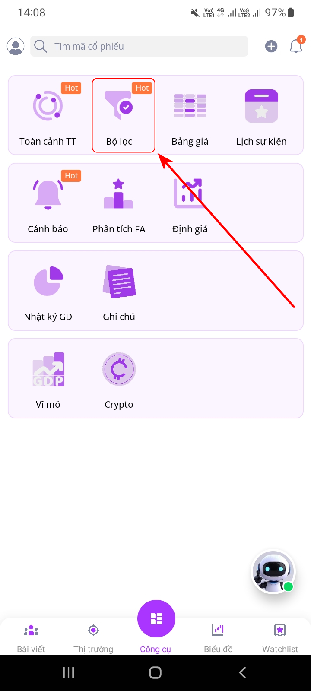
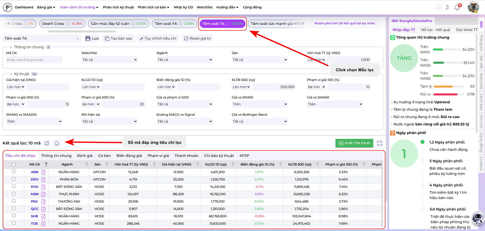
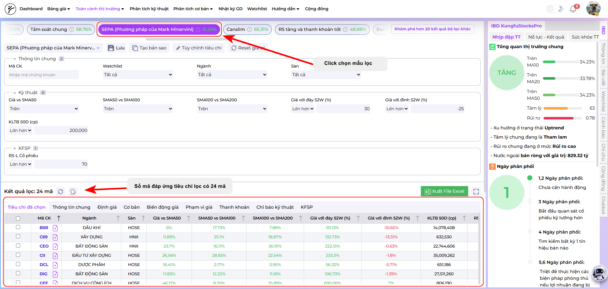
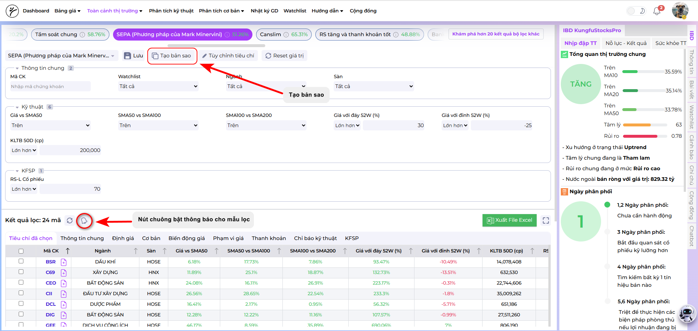
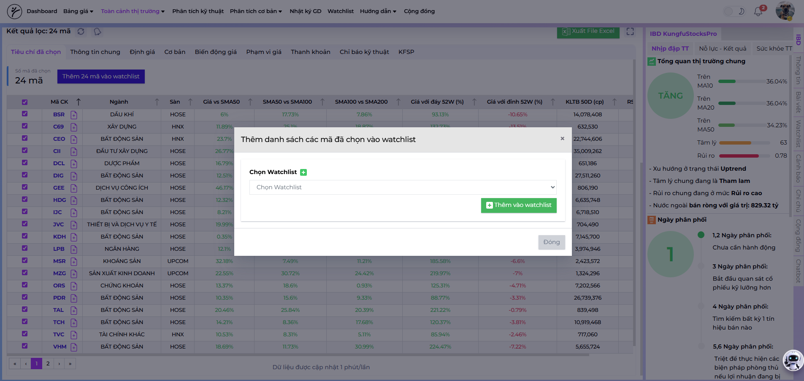
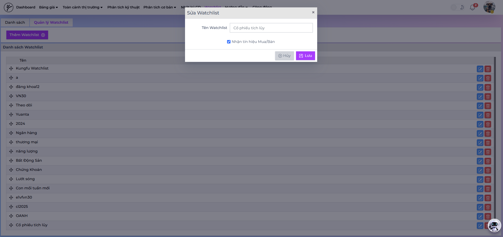

# Hướng Dẫn Sử Dụng Bộ Lọc KFSP: Săn Tìm Cổ Phiếu Tích Lũy và Bùng Nổ

Chào mừng nhà đầu tư đến với hướng dẫn sử dụng **bộ lọc cổ phiếu thông minh của KFSP**. Công cụ này được thiết kế để giúp bạn nhanh chóng xác định các cổ phiếu tiềm năng, đang ở giai đoạn then chốt của chu kỳ giá: **Tích lũy chặt chẽ** hoặc **chuẩn bị bứt phá khỏi nền giá**.

Bằng cách sử dụng các mẫu lọc được thiết kế sẵn, bạn có thể tiết kiệm thời gian và tập trung vào việc phân tích những mã cổ phiếu chất lượng nhất.

---

## 🧭 Bước 1: Truy Cập Bộ Lọc

### Trên Website:
Truy cập trực tiếp vào đường dẫn: [https://kfsp.vn/bo-loc](https://kfsp.vn/bo-loc)

### Trên Ứng Dụng (App):
1. Mở ứng dụng KFSP.  
2. Nhấn vào **biểu tượng bộ lọc màu tím** ở trung tâm thanh điều hướng phía dưới màn hình.  
3. Chọn mục **"Bộ lọc"**.  

---

## 📊 Bước 2: Tìm Cổ Phiếu Trong Giai Đoạn Tích Lũy

Giai đoạn tích lũy là khi giá cổ phiếu đi ngang trong một biên độ hẹp sau một xu hướng giảm. Đây là thời điểm “cá mập” âm thầm thu gom cổ phiếu trước khi bắt đầu một chu kỳ tăng giá mới.

**Mẫu lọc đề xuất:** `Tầm soát TA`

### Tiêu chí chính:
- **Biến động giá ổn định:** Cổ phiếu đi ngang, biến động thu hẹp dần theo thời gian (tính chất VCP).  
- **Nền giá chặt chẽ:** Giá đóng cửa nằm trên các đường trung bình động (SMA).  
- **Chỉ báo kỹ thuật trung tính:** Kết hợp thêm chỉ báo MACD, RSI, Bollinger Bands.  

### Cách sử dụng:
Tại trang "Bộ lọc", tìm và nhấn chọn vào mẫu lọc có tên **"Tầm soát TA"**.  
Hệ thống sẽ tự động áp dụng các tiêu chí và hiển thị danh sách cổ phiếu phù hợp.

### Hành động đề xuất:
- Ưu tiên các cổ phiếu có **khối lượng giao dịch cạn kiệt** trong vài phiên gần đây.  
- **Vẽ vùng hỗ trợ/kháng cự** để xác định điểm mua lý tưởng khi giá bật tăng trở lại.

---

## 🚀 Bước 3: Tìm Cổ Phiếu Chuẩn Bị Bứt Phá (Breakout)

Đây là giai đoạn cổ phiếu phá vỡ vùng kháng cự quan trọng sau khi tích lũy, chính thức bước vào xu hướng tăng mạnh.

**Mẫu lọc đề xuất:** `SEPA (Phương pháp của Mark Minervini)`

### Cách sử dụng:
1. Tại trang “Bộ lọc”, chọn mẫu **"SEPA (Phương pháp của Mark Minervini)"**.  
2. Hệ thống hiển thị danh sách cổ phiếu có xu hướng tăng và hội tụ đủ tiêu chí của một “siêu cổ phiếu” tiềm năng.

### Hành động đề xuất:
- **Tập trung vào cổ phiếu gần đỉnh 52 tuần.**  
- **Quan sát điểm phá vỡ (Pivot Point):** Khi giá vượt kháng cự với khối lượng tăng 40–50%.  
- **Kết hợp yếu tố cơ bản:** Doanh thu, lợi nhuận tăng trưởng mạnh.

---

## 🔔 Bước 4: Không Bỏ Lỡ Cơ Hội – Cài Đặt Thông Báo Tự Động

Thị trường luôn biến động, hãy bật thông báo để nhận tin khi có cổ phiếu mới lọt tiêu chí.

1. Chọn mẫu lọc mong muốn và nhấn **"Tạo bản sao"**.  
2. Nhấn **"Lưu"** để xác nhận.  
3. Quay lại danh sách bộ lọc, chọn **biểu tượng chiếc chuông 🔔** để bật thông báo.

Từ nay, mỗi khi có cổ phiếu mới đáp ứng điều kiện, **KFSP sẽ gửi thông báo ngay đến điện thoại của bạn.**

---

## 🧩 Bước 5: Lưu vào Watchlist & Kích Hoạt Tín Hiệu Giao Dịch Tự Động

Sau khi lọc ra danh sách cổ phiếu tiềm năng, hãy theo dõi chúng bằng Watchlist và bật BOT tín hiệu giao dịch tự động.

### Phần 1: Thêm Cổ Phiếu Vào Watchlist
- **Chọn cổ phiếu:** Tích chọn tất cả hoặc từng mã quan tâm.  
- **Nhấn nút “Thêm vào Watchlist”**.  
- **Chọn hoặc tạo mới Watchlist** (ví dụ: “Cổ phiếu sepa tiềm năng”).  

### Phần 2: Kích Hoạt Tín Hiệu Mua/Bán
1. Truy cập [https://kfsp.vn/watchlist](https://kfsp.vn/watchlist).  
2. Chọn tab **"Quản lý watchlist"**, nhấn biểu tượng **✏️ Sửa**.  
3. Tích chọn **"Nhận tín hiệu Mua/Bán"**.

Từ đây, mỗi khi cổ phiếu trong Watchlist có tín hiệu mới từ BOT, bạn sẽ **nhận thông báo ngay lập tức**.

---

🎯 **Chúc nhà đầu tư giao dịch thành công!**
